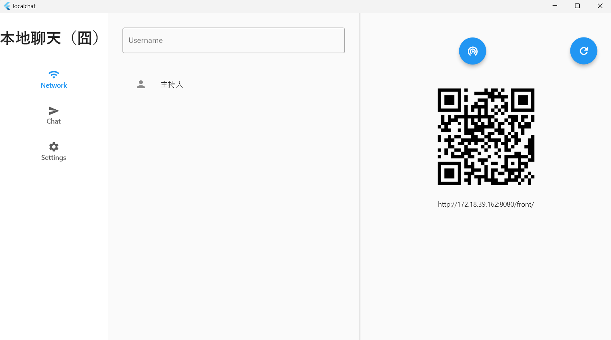
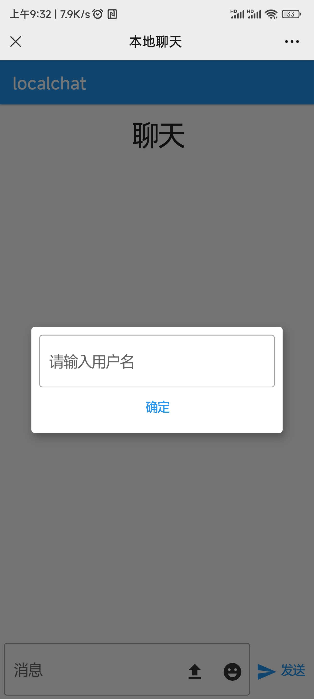

# localchat

Instant chats with other people on local network by sharing text and files.

## Getting Started
Download Release from [Release](https://github.com/NightsLight-hub/localchat/releases), 
decompress it and then run `localchat.exe` on Windows.



Congratulations, you are now the host of a local chat room.
Anyone who wants to join the chat room can choose to scan the QR code on the right
, or just open the URL below the QR code using a browser(on your pc or **phone**)



Submit nickName, and then enjoy the chat!

## Development
### First of all, use FVM
we use fvm to manage flutter version, so you should install [fvm](https://fvm.app/docs/getting_started/overview) first.

### My flutter version info
```
fvm flutter --version
Flutter 3.13.8 • channel stable • https://github.com/flutter/flutter.git
Framework • revision 6c4930c4ac (9 weeks ago) • 2023-10-18 10:57:55 -0500
Engine • revision 767d8c75e8
Tools • Dart 3.1.4 • DevTools 2.25.0
```

### Build 
Build the release package from code by using `build.bat`

```shell
build.bat
```

### Or just build web 
```shell
fvm flutter build web  --base-href /front/ --release -t lib/web/web_main.dart --web-renderer html
```
必须用`html`模式渲染， 用 `canvas`渲染 似乎拖拽会出问题


### Or just build server
```shell
fvm flutter build windows --release
```

### code generation command
```shell
fvm dart pub run build_runner build
```
## debug
During development, both the front-end and back-end start independently, 
so the front-end cannot directly use window.host.href as the server address.

we can set the environment variable `BUILD_MODE=debug` to tell the front-end 
to use localhost:8080 as the server address.

# development plan
* [ ] chat room password 
* [ ] image message will be rendered on conversation page
* [ ] multiple file upload
* [ ] pc chats
* [ ] Disconnect and reconnect, user re register logic.
* [x] Desktop sends files
* [x] File message download and opening (both desktop and web have been completed)
* [x] Web side file upload
* [ ] Message broadcast - under development
* [x] Segmented upload

# 感谢
inspired by [localsend](https://github.com/localsend/localsend)
